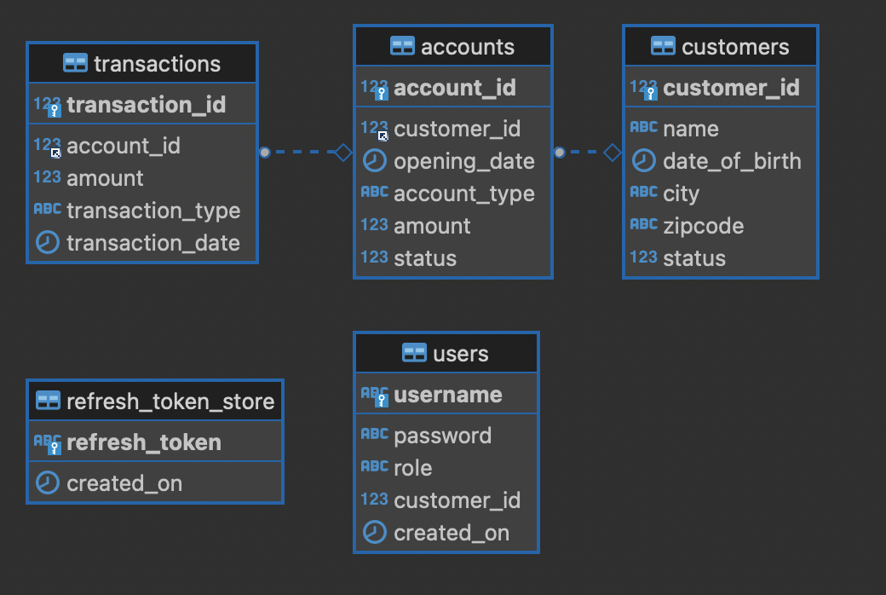

# just-bank

Learn go with real example

- Golang

- Rest API

- Hexagonal Architect

### APIs:

> Get All Customers      
GET  /customers

> Get Customer by ID    
GET  /customers/{customer_id}

> Create new account    
POST /customers/{customer_id}/accounts

> Make a transaction     
POST /customers/{customer_id}/accounts/{account_id}

### Database Schema

### How to run local

- Start MySQL instance

- Run `SERVER_ADDRESS=localhost SERVER_PORT=8000 DB_USER=just_bank_user DB_PASSWORD=password DB_NAME=just_bank_db go run main.go`

### Code coverage